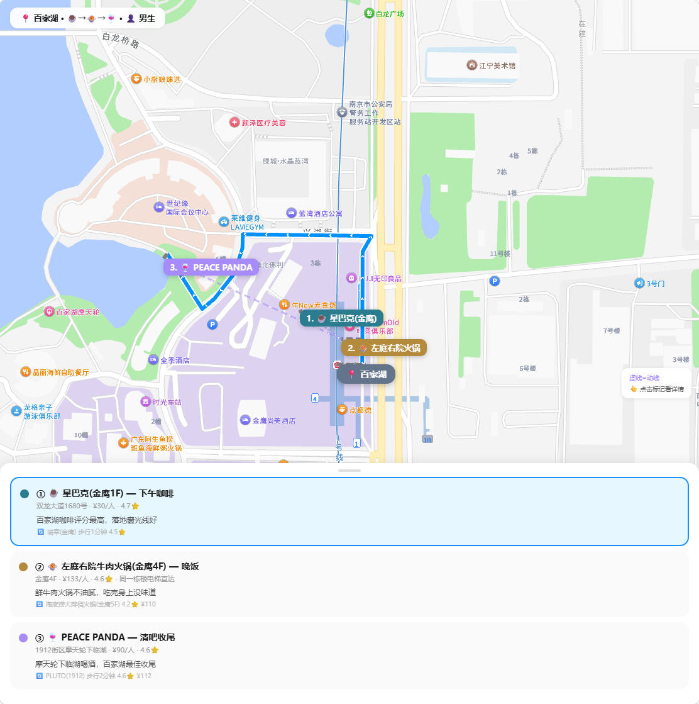
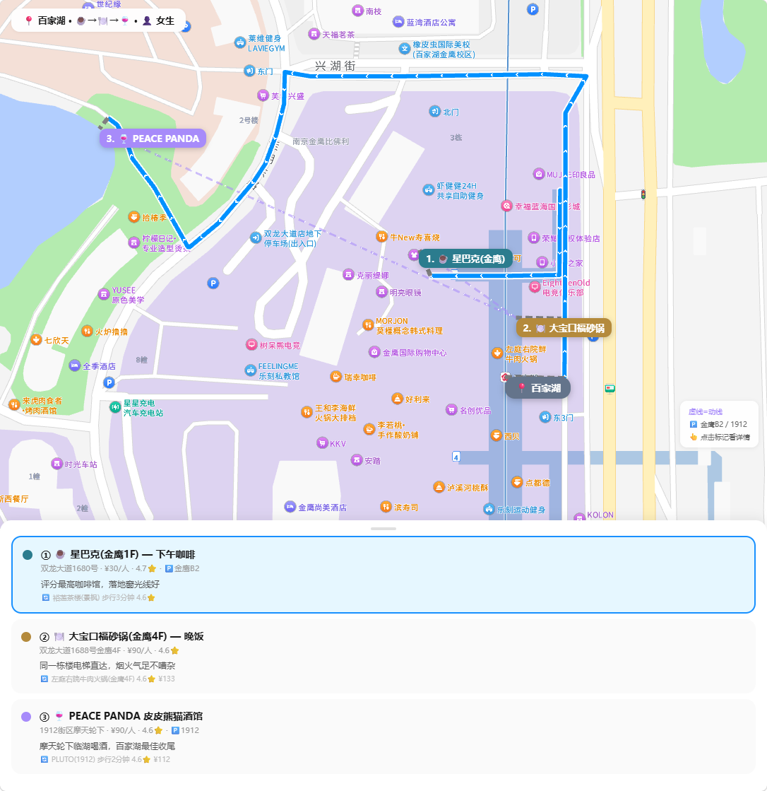
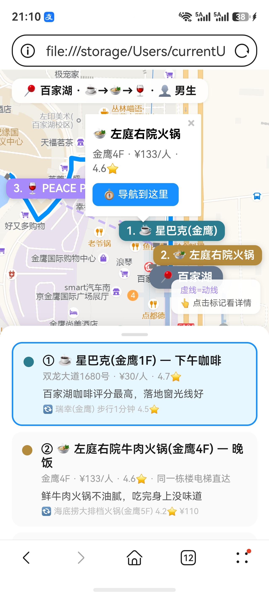
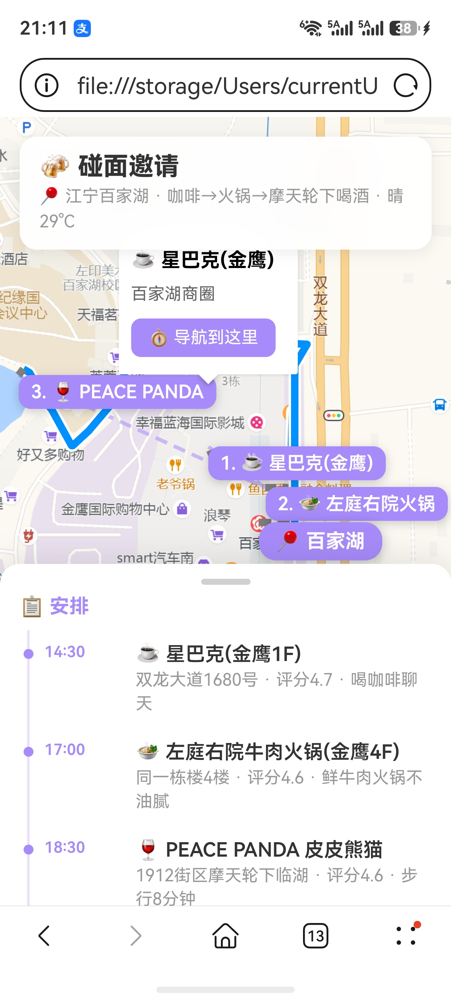

<div align="center">

# 💕 Date Spot — 智能约会助手

**找个地方 + 规划动线 + 生成邀请卡片。一句话 → 一张可以发给 ta 的约会请帖。**

[](https://lbs.amap.com/)
[]()
[]()

[📖 场景](#-场景) · [📸 效果演示](#-效果演示) · [✨ 核心功能](#-核心功能) · [📊 示例](#-示例) · [🚀 安装](#-安装) · [💬 使用](#-使用) · [❓ 常见问题](#-常见问题) · [📂 项目结构](#-项目结构) · [English](#english)

</div>

---

## 📖 场景

> 小林，大四，终于鼓起勇气约了隔壁班的女生见面。
>
> 她在河西万达，他在大行宫，两人约好找个中间的地方。**但去哪呢？**
>
> 打开大众点评满屏推荐，不知道哪家安静适合聊天；百度搜"南京约会地点"，全是营销号软文。
>
> 他在 AI 助手里说了一句：**"我在大行宫，她在河西万达，找个中间的地方，第一次见面"**

然后，Date Spot 帮他找到了一家步行 4 分钟的湖边咖啡馆，附上了导航链接。

```
📍 推荐区域：莫愁湖附近

1. ☕ 湖畔咖啡馆 — 浪漫
   📌 莫愁路 88 号 · 步行约 4 分钟
   🚶 你 地铁15分钟 | 她 步行8分钟
   ✨ 靠窗位能看到湖景，安静适合聊天

2. 🌿 莫愁湖公园 — 轻松
   📌 水西门大街 · 步行约 6 分钟

3. 📚 先锋书店 — 文艺
   📌 五台山体育馆 · 步行约 12 分钟

🏆 如果只选一个：选湖畔咖啡馆——离双方都近，安静，靠窗有湖景
```

## 📸 效果演示

**电脑端 · 决策地图**：推荐点 + 动线虚线 + 点击 Marker 弹详情 + 底部卡片

<p align="center">
  
</p>

**电脑端 · 邀请卡片**：请帖风格 + 地图 + 动线时间轴 + 导航 CTA

<p align="center">
  
</p>

**手机端 · 地图 + 导航**：全屏地图 + 底部抽屉面板 + 点击导航

<p align="center">
  
</p>

**手机端 · 邀请卡片**：微信直接打开 + 可拖拽面板 + 一键导航

<p align="center">
  
</p>

## ✨ 核心功能

| 你只需要说 | 助手帮你做 |
|:---|:---|
| "第一次见面，在 XX" | 12 种时段模式匹配 → 周边 13 类 POI 搜索 → 筛选 → 3 个推荐 + 动线 |
| "我在 XX，她在 YY" | 地理编码 → 计算中点 → 分别算通勤 → 公平性评估 |
| "生成邀请卡片" | 🆕 生成约会请帖 HTML——发给 ta，地图/动线/着装一页搞定 |
| "太贵了，换一个" | 解析不满原因 → 缩小范围 → 推荐 3 个新的 |

### 🎯 12 种时段模式

| 模式 | 说明 | 动线 |
|------|------|:--:|
| 🥐 午饭局 | 中午吃个饭 | 午饭→咖啡 |
| ☕ 下午茶 | 喝杯咖啡简单见 | 咖啡→（散步） |
| 🍽️ 纯晚饭 | 下班后吃个饭 | 晚饭→（酒吧） |
| 🌙 晚饭+续摊 | 吃+喝+深夜 | 晚饭→酒吧 |
| 🎬 电影+吃饭 | 先看后吃有话题 | 电影→晚饭 |
| 🥂 纯喝一杯 | 坐坐小酌 | 酒吧→（第二家） |
| 🎯 活动优先 | 密室/看展/剧本杀 | 活动→吃饭 |
| 🛍️ 逛街+吃饭 | 商场一站式 | 商场→餐厅 |
| 🌤️ 全天 | 周末一整天 | 午→逛→晚→夜 |
| ... | *共 12 种，全覆盖* | |

### 💌 约会邀请卡片

选定方案后，生成一张可直接发给对方的 HTML 邀请卡片：
- 🗺️ 全屏地图 + 会面点 + 推荐点 + 路线
- 📋 动线时间轴（只放时间+场所，不暴露"作战计划"）
- 👔 贴心提醒（交通+着装，不放礼物/预算/冷场策略）
- 🎨 4 种主题色：薄荷绿（初识）/ 薰衣草紫（朋友）/ 暖粉（情侣）/ 深蓝灰（商务）
- 📱 移动端微信直接打开，一键导航

### 🧠 约会行为指南

不只是推荐地点——从到场到散场的完整行为脚本：
- 🎁 礼物策略（什么时候带/带什么）
- 🗣️ 话题三阶段 + 避雷表
- 🧊 冷场救援 3 话题
- 🚦 节奏信号识别（绿灯/黄灯/散场）
- 👋 散场公式 + 📱 散场后消息模板
- 👔 着装速查（6 种场所 × 男女双视角）

## 📊 示例

两个真实场景，基于高德 API 实时数据生成：

| 场景 | 模式 | 动线 | 文件 |
|------|------|------|------|
| 🍲 百家湖·咖啡→火锅→清吧 | ☕→🍲→🍷 | 星巴克→左庭右院→PEACE PANDA | [`examples/baijiahu-hotpot-bar/`](examples/baijiahu-hotpot-bar/) |
| 🎬 九龙湖+万达·西餐→电影→清吧 | 🍽️→🎬→🍷 双人 | 乐班→幸福蓝海→PLUTO | [`examples/jiulonghu-wanda/`](examples/jiulonghu-wanda/) |

每个示例：`report.md`（报告+原始API数据） + `map.html`（决策地图） + `invitation.html`（邀请卡片） + `date_plan.csv` + `date_pois.csv`（完整搜索结果）

<details>
<summary>📄 百家湖 · ☕→🍲→🍷 · 男生 · 地铁（点击展开完整报告）</summary>

```
🌤️ 29°C 晴 · 室内空调

📍 江宁百家湖（金鹰+1912 街区）

1. ☕ 星巴克(江宁金鹰店) — 下午咖啡
   📌 双龙大道 1680 号金鹰 1F · 步行约 2 分钟
   💰 人均约 ¥30 · ⭐4.7
   ✨ 百家湖咖啡评分最高，落地窗光线好
   🔄 备选：瑞幸(金鹰) 步行 1 分钟 4.5⭐

2. 🍲 左庭右院牛肉火锅(金鹰4F) — 晚饭
   📌 金鹰 4F · 同一栋楼电梯直达
   💰 人均约 ¥133 · ⭐4.6
   ✨ 鲜牛肉火锅不油腻，吃完身上没味道
   🔄 备选：海底捞大排档火锅(金鹰5F) 4.2⭐

3. 🍷 PEACE PANDA 皮皮熊猫酒馆 — 清吧收尾
   📌 1912 街区摩天轮下临湖 · 步行 8 分钟
   💰 人均约 ¥90 · ⭐4.6
   ✨ 摩天轮下临湖喝酒，百家湖最有记忆点的收尾

🏆 如果只选一个：PEACE PANDA——摩天轮下临湖，约会照天花板

🗺️ 动线：14:30 星巴克 → 17:00 火锅 → 18:30 步行到 1912 → 摩天轮下喝酒

💡 小贴士
  · 🎁 不用带礼物 · 🗣️ 从咖啡切入自然开场
  · ⚠️ 别全程聊工作 · 👔 smart casual 干净衬衫+长裤
  · 💰 预计总花费约 ¥253/人
```
</details>

## 🚀 安装

```bash
openclaw skills install @dongdongyue/amap-date-spot
```

### 环境变量

| 变量名 | 必填 | 获取方式 |
|--------|------|----------|
| `AMAP_API_KEY` | ✅ | [高德开放平台](https://lbs.amap.com/) → 控制台 → 添加 Key → 类型选「Web 服务」 |
| `AMAP_JSAPI_KEY` | ❌ | 同上，类型选「Web端(JS API)」，用于交互地图 |
| `AMAP_SECURITY_JS_CODE` | ❌ | JS API 安全密钥 |

> 免费额度：5000 次/天。

## 💬 使用

```
"新街口附近，第一次见面，下午喝杯咖啡"         → ☕ 下午茶模式
"我在大行宫，她在河西万达，吃日料喝一杯"        → 🌙 双人模式
"江宁百家湖，下午咖啡→火锅→清吧，开车"          → 三站动线
"帮我生成邀请卡片"                             → 💌 发出 HTML 请帖
```

## ❓ 常见问题

**Q: 推荐的店我不喜欢怎么办？**
说"太贵了""太远了""换一个"，助手会根据反馈重新推荐，不复述已推过的。

**Q: 支持哪些城市？**
全国有高德 POI 数据的城市都支持。天气联动覆盖全国。

**Q: 需要装 Python 吗？**
不需要。纯提示词驱动，AI 助手直接调用高德 HTTP API。

## 📂 项目结构

```
amap-date-spot/
├── README.md
├── SKILL.md                       # Skill 定义（核心）
├── skill.json                     # 元数据
├── LICENSE                        # MIT 协议
├── docs/                          # 效果截图
│   ├── screenshot-map.png
│   ├── screenshot-invitation.png
│   ├── mobile-map-link.jpg
│   └── mobile-map-invitation.jpg
├── references/
│   ├── invitation-card.html       # 邀请卡片模板（4主题色）
│   ├── html-template-map.md       # 决策地图模板
│   ├── text-card-date-spot.md     # CSS 降级卡片
│   └── text-card-template.md      # 纯文本输出格式
├── examples/
│   ├── baijiahu-hotpot-bar/       # ☕→🍲→🍷 咖啡+火锅+清吧
│   └── jiulonghu-wanda/           # 🍽️→🎬→🍷 西餐+电影+清吧（双人）
├── .env.example
├── .gitignore
└── skill.json
```

### 调用的高德 API

| API | 用途 |
|-----|------|
| `geocode/geo` | 地名 → 坐标 |
| `geocode/regeo` | 坐标 → 地名（中点逆地理编码） |
| `place/around` | 周边 POI 搜索（13 类） |
| `place/text` | 锚点场所搜索 |
| `direction/transit/integrated` | 公交路线 |
| `direction/walking` | 步行路线 |
| `direction/driving` | 驾车路线 |
| `weather/weatherInfo` | 天气查询 |

---

## English

### Scenario

> Xiaolin finally asked a girl to meet up. She's at Hexi Wanda, he's at Daxinggong. **But where?**

He said one sentence: **"I'm at Daxinggong, she's at Hexi Wanda, find us somewhere — first date"**

Date Spot found a lakeside café, 4 minutes walk, with a navigation link.

### What it does

- **12 time modes**: lunch, afternoon tea, dinner, dinner+bar, movie+dinner, drinks only, full day...
- **Smart venue search**: 13 POI categories with cuisine filtering + dietary restrictions
- **Dual-location midpoint**: auto-calculates fair meeting point
- **Weather-aware**: won't recommend parks on rainy days
- **Invitation card**: shareable HTML with map, itinerary, dress code — no "battle plan" exposed
- **Date behavior guide**: gift strategy, conversation topics, ice-breakers, signals, exit script
- **4 color themes**: mint (first meet), purple (friends), pink (couples), grey (business)

### Demo

<p align="center">
  
  
  
  
</p>

### Install

```bash
openclaw skills install @dongdongyue/amap-date-spot
```

> Requires a free Amap API Key.

### Environment Variables

| Variable | Required | How to get it |
|----------|----------|---------------|
| `AMAP_API_KEY` | ✅ | [Amap Open Platform](https://lbs.amap.com/) → Console → Add Key → type: 「Web Service」 |
| `AMAP_JSAPI_KEY` | ❌ | Same, type: 「Web(JS API)」 — for interactive maps |
| `AMAP_SECURITY_JS_CODE` | ❌ | JS API security code |

### Usage

```
"First date near Xinjiekou, afternoon coffee"           → ☕ Afternoon tea mode
"I'm at Daxinggong, she's at Hexi Wanda — Japanese+drinks" → 🌙 Dual mode
"Generate an invitation card"                            → 💌 Shareable HTML
```

### FAQ

**Q: What if I don't like the recommendations?**
Just say "too expensive" — the assistant adjusts and recommends 3 new places.

**Q: Which cities are supported?**
All cities in China with Amap POI data.

**Q: Do I need Python?**
No. Pure prompt-driven, AI calls Amap HTTP API directly.

---

## 📝 License

MIT
